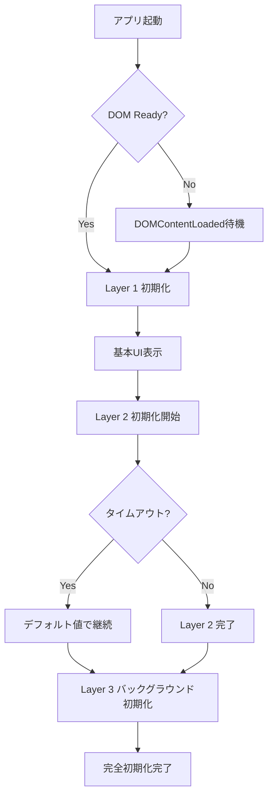

# アプリケーション初期化のベストプラクティスガイド

## 目次
1. [初期化アーキテクチャ](#初期化アーキテクチャ)
2. [実装パターン](#実装パターン)
3. [エラーハンドリング](#エラーハンドリング)
4. [パフォーマンス最適化](#パフォーマンス最適化)
5. [デバッグとトラブルシューティング](#デバッグとトラブルシューティング)
6. [コードサンプル](#コードサンプル)

## 初期化アーキテクチャ

### 初期化の3層構造

```
┌─────────────────────────────────────┐
│      Layer 1: Critical Core         │
│  (必須・即座に初期化)               │
│  - DOM要素                          │
│  - エラーハンドリング               │
│  - 基本UI表示                       │
└─────────────────────────────────────┘
                 ↓
┌─────────────────────────────────────┐
│      Layer 2: Essential Features    │
│  (重要・短いタイムアウト付き)       │
│  - ユーザー設定                     │
│  - 認証情報                         │
│  - メインナビゲーション             │
└─────────────────────────────────────┘
                 ↓
┌─────────────────────────────────────┐
│      Layer 3: Enhanced Features     │
│  (オプション・バックグラウンド)     │
│  - 分析機能                         │
│  - キャッシュプリロード             │
│  - 追加プラグイン                   │
└─────────────────────────────────────┘
```

### 初期化フローチャート



## 実装パターン

### 1. サービスクラスの初期化パターン

```typescript
// ✅ 推奨: 明示的な初期化メソッド
export class DataService {
  private initialized = false;
  private data: any = null;
  
  constructor() {
    // コンストラクタは最小限に
    // 外部依存なし、副作用なし
  }
  
  async initialize(): Promise<void> {
    if (this.initialized) return;
    
    try {
      // タイムアウト付き初期化
      this.data = await this.loadDataWithTimeout(3000);
      this.initialized = true;
    } catch (error) {
      console.error('[DataService] Initialization failed:', error);
      // デフォルト値で継続
      this.data = this.getDefaultData();
      this.initialized = true;
    }
  }
  
  private async loadDataWithTimeout(ms: number): Promise<any> {
    return Promise.race([
      this.loadData(),
      new Promise((_, reject) => 
        setTimeout(() => reject(new Error('Timeout')), ms)
      )
    ]);
  }
  
  private getDefaultData(): any {
    return { /* デフォルト値 */ };
  }
}

// 使用例
const service = new DataService();
await service.initialize(); // 明示的に初期化
```

### 2. ストアの初期化パターン

```typescript
// ✅ 推奨: 遅延初期化ストア
import { writable, derived, get } from 'svelte/store';

export function createLazyStore<T>(
  initialValue: T,
  loader: () => Promise<T>
) {
  const store = writable<T>(initialValue);
  const loading = writable(false);
  const error = writable<Error | null>(null);
  
  let initialized = false;
  
  async function initialize(): Promise<void> {
    if (initialized) return;
    
    loading.set(true);
    error.set(null);
    
    try {
      const data = await loader();
      store.set(data);
      initialized = true;
    } catch (e) {
      error.set(e as Error);
      console.error('Store initialization failed:', e);
    } finally {
      loading.set(false);
    }
  }
  
  return {
    subscribe: store.subscribe,
    initialize,
    loading: { subscribe: loading.subscribe },
    error: { subscribe: error.subscribe },
    reset: () => {
      initialized = false;
      store.set(initialValue);
    }
  };
}

// 使用例
export const userSettings = createLazyStore(
  { theme: 'light' }, // デフォルト値
  async () => {
    // 非同期でデータロード
    return await loadUserSettings();
  }
);
```

### 3. アプリケーションの段階的初期化

```typescript
// App.svelte
<script lang="ts">
  import { onMount } from 'svelte';
  
  let initStage: 'loading' | 'partial' | 'ready' = 'loading';
  let initError: string | null = null;
  
  onMount(async () => {
    const initController = new InitializationController();
    
    try {
      // Stage 1: 即座に表示
      await initController.initializeCritical();
      initStage = 'partial';
      
      // Stage 2: 重要な機能（タイムアウト付き）
      await initController.initializeEssential(5000);
      initStage = 'ready';
      
      // Stage 3: バックグラウンドで拡張機能
      initController.initializeEnhanced().catch(console.error);
      
    } catch (error) {
      initError = error.message;
      // エラーでも基本UIは表示
      initStage = 'partial';
    }
  });
</script>

{#if initStage === 'loading'}
  <LoadingScreen />
{:else if initError}
  <ErrorRecovery {initError} />
{:else}
  <MainApp partial={initStage === 'partial'} />
{/if}
```

### 4. 初期化コントローラー

```typescript
class InitializationController {
  private abortController = new AbortController();
  
  async initializeCritical(): Promise<void> {
    // 必須コンポーネントのみ
    await Promise.all([
      this.setupErrorHandlers(),
      this.initializeDOM(),
      this.loadCriticalCSS()
    ]);
  }
  
  async initializeEssential(timeout: number): Promise<void> {
    const essentialTasks = [
      this.loadUserSettings(),
      this.initializeAuth(),
      this.setupRouting()
    ];
    
    // タイムアウト付きで実行
    const results = await Promise.allSettled(
      essentialTasks.map(task => 
        this.withTimeout(task, timeout)
      )
    );
    
    // 失敗したタスクをログ
    results.forEach((result, index) => {
      if (result.status === 'rejected') {
        console.warn(`Essential task ${index} failed:`, result.reason);
      }
    });
  }
  
  async initializeEnhanced(): Promise<void> {
    // バックグラウンドで実行
    await this.delay(100); // UIスレッドを解放
    
    const enhancedTasks = [
      this.preloadImages(),
      this.initializeAnalytics(),
      this.setupWebSocket()
    ];
    
    // 順次実行（優先度順）
    for (const task of enhancedTasks) {
      try {
        await task.call(this);
      } catch (error) {
        console.error('Enhanced feature failed:', error);
        // 継続
      }
    }
  }
  
  private withTimeout<T>(
    promise: Promise<T>,
    ms: number
  ): Promise<T> {
    return Promise.race([
      promise,
      new Promise<T>((_, reject) =>
        setTimeout(() => reject(new Error('Timeout')), ms)
      )
    ]);
  }
  
  private delay(ms: number): Promise<void> {
    return new Promise(resolve => setTimeout(resolve, ms));
  }
}
```

## エラーハンドリング

### エラーバウンダリの実装

```typescript
// ErrorBoundary.svelte
<script lang="ts">
  import { onMount, createEventDispatcher } from 'svelte';
  
  export let fallback = 'An error occurred';
  export let onError: (error: Error) => void = () => {};
  
  let hasError = false;
  let error: Error | null = null;
  
  const dispatch = createEventDispatcher();
  
  function handleError(e: Error) {
    hasError = true;
    error = e;
    onError(e);
    dispatch('error', e);
    
    // エラーレポート
    reportError(e);
  }
  
  function retry() {
    hasError = false;
    error = null;
    dispatch('retry');
  }
  
  onMount(() => {
    // グローバルエラーハンドラー
    const originalHandler = window.onerror;
    
    window.onerror = (msg, source, lineno, colno, err) => {
      if (err) handleError(err);
      return originalHandler?.(msg, source, lineno, colno, err);
    };
    
    return () => {
      window.onerror = originalHandler;
    };
  });
</script>

{#if hasError}
  <div class="error-boundary">
    <h2>Something went wrong</h2>
    <p>{error?.message || fallback}</p>
    <button on:click={retry}>Retry</button>
  </div>
{:else}
  <slot />
{/if}
```

### グレースフルデグラデーション

```typescript
// 機能の段階的な無効化
class FeatureManager {
  private features = new Map<string, boolean>();
  
  async checkFeature(name: string): Promise<boolean> {
    try {
      // 機能の利用可能性をチェック
      const available = await this.testFeature(name);
      this.features.set(name, available);
      return available;
    } catch {
      // エラー時は機能を無効化
      this.features.set(name, false);
      return false;
    }
  }
  
  private async testFeature(name: string): Promise<boolean> {
    switch (name) {
      case 'websocket':
        return 'WebSocket' in window;
      case 'localstorage':
        try {
          localStorage.setItem('test', 'test');
          localStorage.removeItem('test');
          return true;
        } catch {
          return false;
        }
      default:
        return false;
    }
  }
}
```

## パフォーマンス最適化

### 1. 遅延読み込み

```typescript
// コンポーネントの遅延読み込み
const LazyComponent = lazy(() => import('./HeavyComponent.svelte'));

// ストアの遅延初期化
let storeInstance: Store | null = null;
export function getStore(): Store {
  if (!storeInstance) {
    storeInstance = createStore();
  }
  return storeInstance;
}
```

### 2. 初期化のバッチ処理

```typescript
class BatchInitializer {
  private queue: Array<() => Promise<void>> = [];
  private running = false;
  
  add(task: () => Promise<void>): void {
    this.queue.push(task);
    if (!this.running) {
      this.process();
    }
  }
  
  private async process(): Promise<void> {
    this.running = true;
    
    while (this.queue.length > 0) {
      // バッチサイズを制限
      const batch = this.queue.splice(0, 3);
      
      // 並列実行
      await Promise.allSettled(
        batch.map(task => task())
      );
      
      // UIスレッドに制御を返す
      await new Promise(resolve => 
        requestIdleCallback(resolve)
      );
    }
    
    this.running = false;
  }
}
```

### 3. メモリ効率的な初期化

```typescript
// WeakMapを使用したキャッシュ
const cache = new WeakMap<object, any>();

function memoizedInit<T>(
  key: object,
  initializer: () => T
): T {
  if (!cache.has(key)) {
    cache.set(key, initializer());
  }
  return cache.get(key);
}
```

## デバッグとトラブルシューティング

### 初期化ログシステム

```typescript
class InitLogger {
  private logs: Array<{
    timestamp: number;
    stage: string;
    message: string;
    duration?: number;
  }> = [];
  
  private startTime = performance.now();
  private stageTimes = new Map<string, number>();
  
  startStage(stage: string): void {
    this.stageTimes.set(stage, performance.now());
    this.log(stage, 'Started');
  }
  
  endStage(stage: string): void {
    const startTime = this.stageTimes.get(stage);
    if (startTime) {
      const duration = performance.now() - startTime;
      this.log(stage, 'Completed', duration);
      this.stageTimes.delete(stage);
    }
  }
  
  log(stage: string, message: string, duration?: number): void {
    const entry = {
      timestamp: performance.now() - this.startTime,
      stage,
      message,
      duration
    };
    
    this.logs.push(entry);
    
    // コンソールに出力
    const prefix = `[Init:${stage}]`;
    const time = `+${entry.timestamp.toFixed(0)}ms`;
    const dur = duration ? ` (${duration.toFixed(0)}ms)` : '';
    
    console.log(`${prefix} ${message} ${time}${dur}`);
  }
  
  getReport(): string {
    return this.logs
      .map(entry => {
        const time = entry.timestamp.toFixed(0).padStart(6);
        const stage = entry.stage.padEnd(20);
        const dur = entry.duration 
          ? `(${entry.duration.toFixed(0)}ms)` 
          : '';
        return `${time}ms | ${stage} | ${entry.message} ${dur}`;
      })
      .join('\n');
  }
}

// 使用例
const logger = new InitLogger();
logger.startStage('Core');
await initCore();
logger.endStage('Core');
```

### 初期化診断ツール

```typescript
class InitDiagnostics {
  static async runDiagnostics(): Promise<DiagnosticReport> {
    const report: DiagnosticReport = {
      timestamp: new Date(),
      environment: this.checkEnvironment(),
      network: await this.checkNetwork(),
      storage: this.checkStorage(),
      performance: this.checkPerformance()
    };
    
    return report;
  }
  
  private static checkEnvironment(): EnvironmentInfo {
    return {
      userAgent: navigator.userAgent,
      platform: navigator.platform,
      language: navigator.language,
      cookieEnabled: navigator.cookieEnabled,
      onLine: navigator.onLine,
      screenResolution: `${screen.width}x${screen.height}`,
      windowSize: `${window.innerWidth}x${window.innerHeight}`
    };
  }
  
  private static async checkNetwork(): Promise<NetworkInfo> {
    const start = performance.now();
    try {
      await fetch('/ping');
      return {
        available: true,
        latency: performance.now() - start,
        type: (navigator as any).connection?.effectiveType
      };
    } catch {
      return {
        available: false,
        latency: -1
      };
    }
  }
  
  private static checkStorage(): StorageInfo {
    const check = (storage: Storage): boolean => {
      try {
        const key = '__test__';
        storage.setItem(key, 'test');
        storage.removeItem(key);
        return true;
      } catch {
        return false;
      }
    };
    
    return {
      localStorage: check(localStorage),
      sessionStorage: check(sessionStorage),
      indexedDB: 'indexedDB' in window,
      quota: (navigator as any).storage?.estimate
        ? 'available' : 'unavailable'
    };
  }
  
  private static checkPerformance(): PerformanceInfo {
    const memory = (performance as any).memory;
    
    return {
      memory: memory ? {
        used: memory.usedJSHeapSize,
        total: memory.totalJSHeapSize,
        limit: memory.jsHeapSizeLimit
      } : null,
      navigation: performance.getEntriesByType('navigation')[0] as any
    };
  }
}
```

## コードサンプル

### 完全な初期化実装例

```typescript
// main.ts
import './styles.css';
import App from './App.svelte';
import { InitializationManager } from './lib/init/InitializationManager';

async function bootstrap() {
  const initManager = new InitializationManager();
  
  try {
    // DOM準備を待つ
    await initManager.waitForDOM();
    
    // アプリケーションを起動
    const app = new App({
      target: document.getElementById('app')!,
      props: {
        initManager
      }
    });
    
    // 初期化を開始
    await initManager.initialize();
    
    return app;
  } catch (error) {
    console.error('Bootstrap failed:', error);
    showFatalError(error);
  }
}

// エラー表示
function showFatalError(error: any) {
  document.body.innerHTML = `
    <div class="fatal-error">
      <h1>Application Failed to Start</h1>
      <p>${error.message}</p>
      <button onclick="location.reload()">Reload</button>
    </div>
  `;
}

// 起動
bootstrap().catch(console.error);
```

### InitializationManager実装

```typescript
// InitializationManager.ts
export class InitializationManager extends EventTarget {
  private stages = new Map<string, InitStage>();
  private logger = new InitLogger();
  
  async waitForDOM(): Promise<void> {
    if (document.readyState === 'loading') {
      return new Promise(resolve => {
        document.addEventListener('DOMContentLoaded', () => resolve());
      });
    }
  }
  
  async initialize(): Promise<void> {
    this.dispatchEvent(new Event('init:start'));
    
    try {
      // Critical
      await this.runStage('critical', [
        () => this.setupErrorHandlers(),
        () => this.initializeCore()
      ], { timeout: 2000, required: true });
      
      // Essential
      await this.runStage('essential', [
        () => this.loadSettings(),
        () => this.initializeAuth(),
        () => this.setupUI()
      ], { timeout: 5000, required: false });
      
      // Enhanced (fire and forget)
      this.runStage('enhanced', [
        () => this.loadAnalytics(),
        () => this.preloadAssets()
      ], { timeout: 10000, required: false })
        .catch(error => {
          console.warn('Enhanced features failed:', error);
        });
      
      this.dispatchEvent(new Event('init:complete'));
      
    } catch (error) {
      this.dispatchEvent(new CustomEvent('init:error', { 
        detail: error 
      }));
      throw error;
    }
  }
  
  private async runStage(
    name: string,
    tasks: Array<() => Promise<void>>,
    options: StageOptions
  ): Promise<void> {
    this.logger.startStage(name);
    
    try {
      const promises = tasks.map(task => 
        this.withTimeout(task(), options.timeout)
      );
      
      if (options.required) {
        await Promise.all(promises);
      } else {
        const results = await Promise.allSettled(promises);
        const failures = results.filter(r => r.status === 'rejected');
        
        if (failures.length > 0) {
          console.warn(`Stage ${name}: ${failures.length} tasks failed`);
        }
      }
      
      this.logger.endStage(name);
      
    } catch (error) {
      this.logger.log(name, `Failed: ${error.message}`);
      
      if (options.required) {
        throw error;
      }
    }
  }
  
  private withTimeout<T>(
    promise: Promise<T>,
    ms: number
  ): Promise<T> {
    return Promise.race([
      promise,
      new Promise<T>((_, reject) =>
        setTimeout(() => reject(new Error(`Timeout after ${ms}ms`)), ms)
      )
    ]);
  }
}
```

## まとめ

このガイドで示した初期化パターンとベストプラクティスに従うことで：

1. **堅牢性**: 初期化エラーがアプリ全体をクラッシュさせない
2. **パフォーマンス**: 段階的な初期化により体感速度が向上
3. **保守性**: 明確な初期化フローで問題の特定が容易
4. **ユーザー体験**: 常に何かを表示し、フィードバックを提供
5. **デバッグ容易性**: 詳細なログとメトリクスで問題解決が迅速

これらの原則を適用することで、白い画面問題のような初期化の問題を防ぎ、より良いアプリケーション体験を提供できます。

---

**Version**: 1.0.0  
**Last Updated**: 2025-09-12  
**Author**: Claude Code Assistant