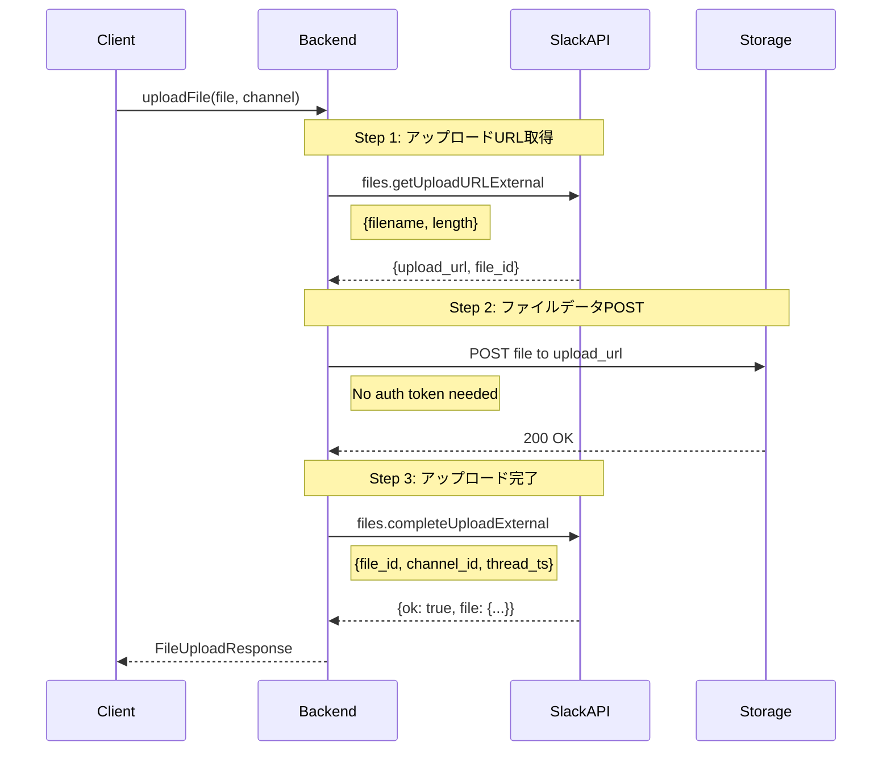

# ファイルアップロード機能実装計画書

**最終更新**: 2025-01-18（Gemini 2.5 PRO評価を反映）
**重要**: Slack files.upload APIは2025年11月12日に廃止されます。本計画書は新しい3ステップワークフローに準拠しています。

## 1. 概要

Personal Slack Clientに、メッセージ投稿およびスレッド返信時のファイルアップロード機能を実装する。

### 1.1 実装する機能
- クリップボードからの画像ペースト
- ローカルファイルの選択・アップロード
- ドラッグ&ドロップによるファイル追加
- アップロードプログレス表示
- ファイルプレビュー機能

### 1.2 重要な前提条件
- **files.upload APIは非推奨**: 2024年5月16日以降の新規アプリでは使用不可
- **新3ステップワークフロー必須**: files.getUploadURLExternal → POST → files.completeUploadExternal
- **Slack SDK推奨**: 複雑な処理を抽象化するuploadV2メソッドの使用を強く推奨

## 2. 技術的実現可能性

### 2.1 現状分析
| 項目 | 状況 | 備考 |
|------|------|------|
| フレームワーク | Tauri v2 + SvelteKit | ファイルシステムアクセス可能 |
| 既存機能 | メッセージ投稿機能実装済み | PostDialog.svelte |
| ファイル表示 | FileAttachments実装済み | 受信ファイルの表示は対応済み |
| API通信 | Slack API連携確立済み | src-tauri/src/slack/api.rs |

### 2.2 必要な技術スタック
```toml
# Cargo.toml追加分
[dependencies]
tauri-plugin-clipboard-manager = "2.0"
tauri-plugin-fs = "2.0"
multipart = "0.18"
slack-morphism = "1.18"  # Rust用Slack SDK（推奨）
```

### 2.3 SDK利用の強力な推奨
Slack公式SDKまたはコミュニティSDKの利用を**強く推奨**します：
- **Node.js**: @slack/web-api (uploadV2メソッド)
- **Python**: slack-sdk (files_upload_v2メソッド)
- **Rust**: slack-morphism

SDK利用のメリット：
- 3ステップワークフローの自動処理
- エラーハンドリングの簡素化
- レート制限の自動対応
- APIバージョン変更への追従

## 3. リスク分析と対策

### 3.1 セキュリティリスク

#### リスク項目
| リスク | 影響度 | 発生確率 | 対策優先度 |
|--------|--------|----------|------------|
| 悪意のあるファイルアップロード | 高 | 中 | 必須 |
| 機密情報の誤送信 | 高 | 中 | 必須 |
| XSS攻撃 | 高 | 低 | 高 |
| CSRF攻撃 | 中 | 低 | 中 |

#### 対策
1. **ファイルバリデーション**
   ```typescript
   const ALLOWED_TYPES = {
     images: ['image/jpeg', 'image/png', 'image/gif', 'image/webp'],
     documents: ['application/pdf', 'text/plain', 'text/markdown'],
     code: ['text/javascript', 'text/typescript', 'application/json']
   };

   const MAX_FILE_SIZE = 100 * 1024 * 1024; // 100MB
   ```

2. **Content Security Policy更新**
   ```json
   {
     "csp": "default-src 'self'; img-src 'self' data: blob: https:; connect-src 'self' https://files.slack.com"
   }
   ```

### 3.2 パフォーマンスリスク

#### 問題と対策
- **大容量ファイル処理**
  - チャンクアップロード実装（10MBごと）
  - Web Worker使用でメインスレッドをブロックしない
  - メモリ効率的なストリーム処理

- **同時アップロード**
  - 最大同時アップロード数制限（デフォルト: 3）
  - キュー管理システム実装

### 3.3 UXリスク

#### 対策実装
```svelte
<!-- UploadConfirmDialog.svelte -->
<script>
  // アップロード前確認
  export let files = [];
  export let totalSize = 0;

  // サムネイル生成
  // ファイルタイプ表示
  // アップロードキャンセル機能
</script>
```

## 4. 実装計画

### 4.1 Phase 1: バックエンド基盤（3-4日）※API変更対応のため延長

#### タスク一覧
- [ ] Slack新3ステップワークフロー実装
  - [ ] files.getUploadURLExternal実装
  - [ ] 一時URLへのファイルPOST処理
  - [ ] files.completeUploadExternal実装
- [ ] Slack SDK (@slack/web-api) 統合
- [ ] ファイルバリデーション機能
- [ ] Tauriプラグイン設定
- [ ] エラーハンドリング基盤（Retry-After対応）

#### 実装ファイル（SDK利用版）
```rust
// src-tauri/src/slack/upload.rs
use slack_sdk::WebClient;

pub async fn upload_file(
    client: &WebClient,
    channel_id: &str,
    file_path: &str,
    initial_comment: Option<String>,
    thread_ts: Option<String>
) -> Result<FileUploadResponse> {
    // SDK's uploadV2 method handles 3-step process internally
    let response = client.files_upload_v2()
        .file_path(file_path)
        .channel_id(channel_id)
        .initial_comment(initial_comment)
        .thread_ts(thread_ts)
        .await?;

    Ok(response)
}
```

#### 手動実装版（参考）
```rust
// 3ステップを個別に実装する場合
pub async fn upload_file_manual(
    token: &str,
    channel_id: &str,
    file_data: Vec<u8>,
    filename: String,
    initial_comment: Option<String>,
    thread_ts: Option<String>
) -> Result<FileUploadResponse> {
    // Step 1: Get upload URL
    let upload_url_response = files_get_upload_url_external(
        token,
        &filename,
        file_data.len()
    ).await?;

    // Step 2: Upload file to URL
    upload_to_url(
        &upload_url_response.upload_url,
        file_data
    ).await?;

    // Step 3: Complete upload
    let complete_response = files_complete_upload_external(
        token,
        &upload_url_response.file_id,
        channel_id,
        initial_comment,
        thread_ts
    ).await?;

    Ok(complete_response)
}
```

### 4.2 Phase 2: フロントエンドUI（3-4日）

#### コンポーネント構成
```
src/lib/components/
├── upload/
│   ├── FileUploadManager.svelte    # メインアップロード管理
│   ├── UploadProgress.svelte       # プログレス表示
│   ├── FilePreview.svelte          # ファイルプレビュー
│   └── UploadQueue.svelte          # アップロードキュー管理
```

#### PostDialog改修内容
```svelte
<!-- PostDialog.svelte改修 -->
<script>
  import FileUploadManager from './upload/FileUploadManager.svelte';

  let attachedFiles = [];
  let uploadManager;

  async function handlePaste(event) {
    const items = event.clipboardData?.items;
    for (const item of items) {
      if (item.type.startsWith('image/')) {
        const file = item.getAsFile();
        await uploadManager.addFile(file);
      }
    }
  }

  async function handleDrop(event) {
    event.preventDefault();
    const files = Array.from(event.dataTransfer.files);
    await uploadManager.addFiles(files);
  }
</script>
```

### 4.3 Phase 3: 統合・テスト（2-3日）

#### テスト項目
1. **機能テスト**
   - [ ] 画像ペースト（PNG, JPEG, GIF）
   - [ ] ファイル選択（単一・複数）
   - [ ] ドラッグ&ドロップ
   - [ ] アップロードキャンセル
   - [ ] エラーリトライ

2. **セキュリティテスト**
   - [ ] 不正ファイルタイプ拒否
   - [ ] サイズ制限確認
   - [ ] XSS脆弱性チェック

3. **パフォーマンステスト**
   - [ ] 100MBファイルアップロード
   - [ ] 同時3ファイルアップロード
   - [ ] メモリリーク確認

## 5. API仕様

### 5.1 Slack API（新3ステップワークフロー）

#### 重要な変更点
- **files.upload廃止**: 2025年11月12日完全廃止、新規アプリでは既に使用不可
- **必須スコープ**: files:write（アップロード用）、files:read（検証用・推奨）

#### 新ワークフローシーケンス


#### APIパラメータ詳細

| ステップ | メソッド | 必須パラメータ | オプション |
|---------|---------|--------------|----------|
| Step 1 | files.getUploadURLExternal | filename, length | alt_txt, snippet_type |
| Step 2 | POST to upload_url | file (binary data) | - |
| Step 3 | files.completeUploadExternal | files[{id, title}] | channel_id, thread_ts, initial_comment |

### 5.2 Tauri Commands

```rust
#[tauri::command]
async fn upload_file_to_slack(
    state: State<'_, AppState>,
    channel_id: String,
    file_path: String,
    message: Option<String>,
    thread_ts: Option<String>,
) -> Result<FileUploadResponse, String> {
    let client = &state.slack_client;

    // レート制限対応
    match client.upload_file(channel_id, file_path, message, thread_ts).await {
        Err(SlackError::RateLimited { retry_after }) => {
            // 指数バックオフ実装
            tokio::time::sleep(Duration::from_secs(retry_after)).await;
            client.upload_file(channel_id, file_path, message, thread_ts).await
                .map_err(|e| e.to_string())
        },
        result => result.map_err(|e| e.to_string())
    }
}

#[tauri::command]
async fn get_clipboard_image(
) -> Result<Option<Vec<u8>>, String> {
    // tauri-plugin-clipboard-manager使用
    // Implementation
}
```

## 6. データ構造

### 6.1 TypeScript Types
```typescript
interface FileUpload {
  id: string;
  file: File;
  status: 'pending' | 'uploading' | 'completed' | 'failed';
  progress: number;
  error?: string;
  slackFileId?: string;
  preview?: string; // base64 for images
}

interface UploadOptions {
  channel: string;
  thread_ts?: string;
  initial_comment?: string;
  share_to_channel?: boolean; // for thread replies
}
```

### 6.2 Rust Structs
```rust
#[derive(Serialize, Deserialize)]
pub struct FileUploadRequest {
    pub channel_id: String,
    pub file_path: String,
    pub filename: Option<String>,
    pub title: Option<String>,
    pub initial_comment: Option<String>,
    pub thread_ts: Option<String>,
}

#[derive(Serialize, Deserialize)]
pub struct FileUploadResponse {
    pub ok: bool,
    pub file: SlackFile,
    pub upload_time_ms: u64,
}
```

## 7. UI/UXデザイン

### 7.1 アップロードエリア
```
┌─────────────────────────────────────┐
│ 📎 ファイルを添付                      │
│ ┌───────────────────────────────┐   │
│ │  ドラッグ&ドロップ              │   │
│ │  または                        │   │
│ │  [ファイルを選択]              │   │
│ └───────────────────────────────┘   │
│                                     │
│ 添付ファイル:                        │
│ ┌──────┐ ┌──────┐ ┌──────┐      │
│ │ IMG  │ │ DOC  │ │ PDF  │      │
│ │ 2MB  │ │ 1MB  │ │ 5MB  │      │
│ └──────┘ └──────┘ └──────┘      │
└─────────────────────────────────────┘
```

### 7.2 プログレス表示
```
アップロード中...
[████████████░░░░░░░] 65% (6.5MB/10MB)
推定残り時間: 5秒
[キャンセル]
```

## 8. 設定項目

### 8.1 ユーザー設定
```typescript
interface UploadSettings {
  maxFileSize: number;           // デフォルト: 100MB
  autoCompress: boolean;          // 画像自動圧縮
  confirmBeforeUpload: boolean;   // アップロード前確認
  allowedFileTypes: string[];     // ファイルタイプ制限
  simultaneousUploads: number;    // 同時アップロード数
}
```

## 9. エラー処理

### 9.1 エラーパターン
| エラー | メッセージ | アクション |
|--------|-----------|------------|
| FILE_TOO_LARGE | ファイルサイズが制限を超えています（最大1GB） | サイズ縮小提案 |
| INVALID_FILE_TYPE | このファイルタイプはサポートされていません | 許可タイプ表示 |
| NETWORK_ERROR | ネットワークエラーが発生しました | リトライボタン表示 |
| PERMISSION_DENIED | ファイルアップロード権限がありません | 権限確認案内 |
| UPLOAD_FAILED | アップロードに失敗しました | 詳細エラーとリトライ |
| RATE_LIMITED | APIレート制限に達しました（429） | Retry-After秒待機後リトライ |
| MISSING_SCOPE | files:writeスコープが不足しています | アプリ再認証を促す |
| CHANNEL_NOT_FOUND | 指定チャンネルが見つかりません | チャンネル確認/参加 |
| FILE_NOT_FOUND | file_idが無効になりました | 3ステップ全体を再実行 |

## 10. Block Kit連携と高度な実装

### 10.1 画像ファイルのBlock Kit統合
画像ファイルの場合、Block Kit内に直接埋め込み可能：
```javascript
// Step 1: ファイルをプライベートでアップロード
const fileResponse = await uploadFile(file, null); // channel_id省略

// Step 2: Block Kitメッセージで画像を表示
const message = {
  channel: channelId,
  blocks: [{
    type: 'image',
    slack_file: { id: fileResponse.file.id },
    alt_text: 'Uploaded image'
  }]
};
await chat.postMessage(message);
```

### 10.2 非画像ファイルの回避策
PDFやテキストファイルの場合：
1. files.completeUploadExternalで一旦投稿
2. chat.updateでBlock Kitメッセージに更新
3. "(edited)"ラベル表示を許容

## 11. 今後の拡張可能性

### 11.1 将来的な機能追加
- 画像編集機能（クロップ、マスキング）
- 動画ファイルサポート
- ファイル圧縮オプション
- クラウドストレージ連携（Google Drive, Dropbox）
- スクリーンショット撮影機能
- OCR機能（画像からテキスト抽出）

### 10.2 パフォーマンス最適化
- CDN経由アップロード
- 並列チャンクアップロード
- 差分アップロード（大容量ファイル）
- キャッシュ機能

## 12. リリース計画

### 11.1 マイルストーン
| フェーズ | 期間 | 完了条件 |
|---------|------|----------|
| Phase 1 | 3-4日 | 新3ステップAPI実装完了 |
| Phase 2 | 3-4日 | UI実装完了 |
| Phase 3 | 2-3日 | テスト完了 |
| リリース準備 | 1日 | ドキュメント・リリースノート |
| **合計** | **10-12日** | 全機能実装・テスト完了 |

### 11.2 ロールアウト戦略
1. 内部テスト（開発環境）
2. ベータテスト（限定ユーザー）
3. 段階的リリース
4. 全体リリース

## 13. 参考資料

### 13.1 関連ドキュメント（更新版）
- [Working with files (新ワークフロー)](https://docs.slack.dev/messaging/working-with-files)
- [files.upload廃止のお知らせ](https://docs.slack.dev/changelog/2024-04-a-better-way-to-upload-files-is-here-to-stay/)
- [files.getUploadURLExternal](https://docs.slack.dev/reference/methods/files.getUploadURLExternal/)
- [files.completeUploadExternal](https://docs.slack.dev/reference/methods/files.completeUploadExternal)
- [Slack SDK uploadV2](https://github.com/slackapi/node-slack-sdk)
- [Tauri v2 Plugin System](https://v2.tauri.app/plugin/)
- [Web Clipboard API](https://developer.mozilla.org/en-US/docs/Web/API/Clipboard_API)
- [File API Specification](https://www.w3.org/TR/FileAPI/)

### 13.2 実装例
- [Slack Web Client実装](https://github.com/slackapi/node-slack-sdk)
- [Python SDK files_upload_v2](https://github.com/slackapi/python-slack-sdk)
- [Tauri File Upload Example](https://github.com/tauri-apps/tauri/tree/dev/examples)

### 13.3 重要な注意事項
- **2024年5月16日以降の新規アプリ**: files.uploadは使用不可
- **2025年11月12日**: files.upload完全廃止
- **推奨**: 公式SDKのuploadV2/files_upload_v2メソッドを使用

---

**作成日**: 2025-01-18
**最終更新**: 2025-01-18（Gemini 2.5 PRO評価反映）
**ステータス**: 計画中（新3ステップAPI準拠）